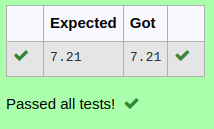

# DISTANCE-BETWEEN-TWO-POINTS

## AIM:
To write a python program to find the distance two 2 points.
## ALGORITHM:
### Step 1: 
Import math.
### Step 2: 
list the elements in array.
### Step 3: 
Substitute the values in the distance formula 

 
### Step 4: 
Print the distance using formula.
### Step 5: 
End the program.
### PROGRAM:
 ``` 
#Program to find the distance between two points.
#Developed by: Sujithra BKN
#RegisterNumber:22008582
import math
x1,x2,y1,y2=10,4,6,2
dist=math.sqrt((x2-x1)**2+(y2-y1)**2)
print("{:.2f}".format(dist))
```
### OUTPUT:

### RESULT:
Thus the program to find the distance between two points is successfully executed.